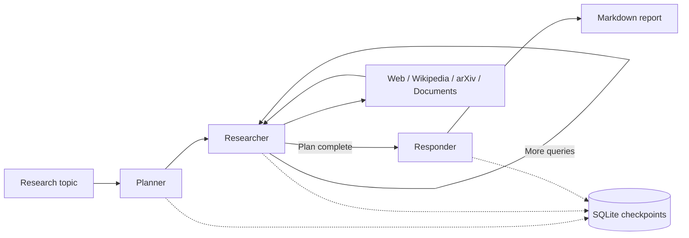

# Research Assistant Agent

[](https://github.com/seekerPrice/research-assistant-agent/actions/workflows/ci.yml)


A stateful research assistant that turns a question into a bounded research plan,
collects source-linked evidence, and writes a Markdown report. Built with **LangGraph**,
**OpenAI/Gemini fallback**, **SQLite checkpointing**, and optional **Pinecone document retrieval**.

**[Read the demo report](examples/demo-report.md)** · **[Architecture](docs/architecture.md)** · **[Contributing](CONTRIBUTING.md)**

## Try it without API keys

With [uv](https://docs.astral.sh/uv/getting-started/installation/) installed:

```bash
git clone https://github.com/seekerPrice/research-assistant-agent.git
cd research-assistant-agent
uv sync --locked
uv run research-assistant --demo --output report.md
```

The demo runs the real graph and saves real SQLite checkpoints. Its model responses and
three source excerpts are fixed fixtures, clearly labeled in the report. It makes **no
network requests** and does not require provider accounts.

<details>
<summary>Prefer pip?</summary>

```bash
python -m venv .venv
source .venv/bin/activate          # Windows: .venv\Scripts\Activate.ps1
pip install -e .
research-assistant --demo --output report.md
```

Python 3.11 or newer is required. `pip install -r requirements.txt` also installs the core project.
Use uv's committed lockfile for reproducible dependency versions.

</details>

## What it does

| Capability | Behavior |
| --- | --- |
| Research planning | Produces up to three queries by default; `--max-steps` supports 1–10. |
| Tool selection | Chooses web, Wikipedia, arXiv, or configured local-document retrieval. |
| Evidence aggregation | Keeps findings from every step, while separating failures from evidence. |
| Model fallback | Prefers OpenAI when configured; tries Gemini if it fails. Either provider can work alone. |
| Durable sessions | Checkpoints each graph step in SQLite; resume interrupted work or read a completed report. |
| Report export | Prints Markdown to stdout and optionally saves it with `--output`. |
| Optional RAG | Indexes your `.txt`/`.md` documents in Pinecone and retrieves relevant chunks. |
| Offline demo | Exercises the workflow with deterministic evidence and responses. |

## How the workflow fits together



The planner resets evidence for each new topic. The researcher executes only available
tools and accumulates their results. The responder synthesizes those results and includes
retrieval failures as limitations. A model answer without a tool call is **not counted as
retrieved evidence**. If all retrieval fails, the report states that no usable evidence was found.

The demo uses the same graph and nodes, replacing only the model and retrieval calls.
See [the architecture notes](docs/architecture.md) for state, persistence, and design tradeoffs.

## Live research

```bash
cp .env.example .env
# Fill in OPENAI_API_KEY or GOOGLE_API_KEY in .env.
uv run research-assistant --topic "How do LangGraph checkpointers support recovery?" \
  --thread-id checkpoint-study --output reports/checkpoint-study.md
```

Progress and the session ID go to **stderr**; the final report goes to **stdout**. This makes
redirection useful too:

```bash
uv run research-assistant --topic "Recent approaches to retrieval augmented generation" > report.md
```

Provider API calls may incur charges. Search queries go to the selected search services;
research evidence goes to the configured model provider. Reports are grounded in returned
snippets, abstracts, and document chunks rather than full independent source verification.

### Continue or revisit a session

```bash
# Finish pending work, or display the report if the run already completed.
uv run research-assistant --resume --thread-id checkpoint-study

# Start another topic with conversation context in the same session.
uv run research-assistant --topic "What are the tradeoffs of SQLite?" \
  --thread-id checkpoint-study

# Use the same flag when revisiting a demo session.
uv run research-assistant --demo --thread-id portfolio
uv run research-assistant --demo --resume --thread-id portfolio
```

Resume uses the last persisted checkpoint. External calls interrupted before their results
were saved may run again. Live and demo sessions must be resumed in their original mode.
Choose a separate session ID for unrelated research.

### Interactive use

```bash
uv run research-assistant --interactive --thread-id research-notebook
```

Enter a topic, read the report, then enter another topic. Type `quit` or `exit` to finish.
When `--output` is used interactively, the file contains the most recent report.
Running with no arguments in a terminal also starts interactive mode.

## Optional document retrieval

Live web/Wikipedia/arXiv research works without Pinecone. To add your own documents:

```bash
uv sync --locked --extra rag
# Set OPENAI_API_KEY and PINECONE_API_KEY in .env.
uv run --extra rag research-ingest --path data
uv run --extra rag research-assistant \
  --topic "Using my local documents, explain this project's persistence design"
```

Pip equivalent: `pip install -e '.[rag]'`.

Ingestion reads UTF-8 `.txt` and `.md` files recursively, skips empty files, and splits them
into 1,000-character chunks with 200-character overlap. It creates a Pinecone serverless
index if one is missing, validates its 1,536 dimensions, and upserts deterministic chunk IDs.
The included [sample document](data/knowledge.txt) contains architecture notes.

Embeddings use OpenAI's `text-embedding-3-small`, so document support needs an OpenAI key
even when Gemini handles generation. Document chunks are sent to OpenAI for embeddings
and stored in Pinecone. Use the same index and namespace for ingestion and retrieval.
Removing documents or shortening them can leave old chunks in the index; use a new
namespace for a clean rebuild. Indexing and vector queries can incur service charges.

## Configuration

Configuration is read from the environment and the current directory's `.env` file.
Environment variables take precedence.

| Variable | Default / requirement |
| --- | --- |
| `OPENAI_API_KEY` | Optional if Google is configured; required for document embeddings. |
| `GOOGLE_API_KEY` | Optional fallback or sole generation provider; `GEMINI_API_KEY` is also accepted. |
| `OPENAI_MODEL` | `gpt-5-nano` |
| `GOOGLE_MODEL` | `gemini-2.5-flash` |
| `PINECONE_API_KEY` | Required for optional document support. |
| `PINECONE_INDEX_NAME` | `research-assistant` |
| `PINECONE_NAMESPACE` | `research-assistant` |
| `PINECONE_CLOUD` / `PINECONE_REGION` | `aws` / `us-east-1`, used only when creating an index. |

`research-assistant --help` lists the CLI options. Useful flags include `--db PATH` for a
separate checkpoint file, `--max-steps N`, and `--verbose` for diagnostics. The previous
`--thread_id` spelling remains available as an alias.

## Tests and development

```bash
uv sync --locked --all-extras --dev
uv run --all-extras pytest
uv run ruff check .
uv run ruff format --check .
uv build
```

Tests exercise real graph execution, SQLite persistence, CLI subprocesses, document
splitting, source-link handling, and provider fallback. Only external service calls are
replaced. CI runs the suite and the offline demo on Python 3.11 and 3.13.
Paid provider and Pinecone calls are not exercised in ordinary CI.

## Limitations and troubleshooting

- **No credentials:** use `--demo`, or configure either generation provider in `.env`.
- **Unavailable search service:** retrieval failures appear in the report; a run with no
  usable findings exits with status 1. Narrow the topic or retry later.
- **Provider failure:** verify the key, model availability, billing quota, and connection.
  `--verbose` shows diagnostics. Gemini is tried only when its key is configured.
- **Unknown session:** use the original session ID and `--db` file. SQLite stores report
  content and research state locally; it is intended for one local CLI user.
- **Pinecone dimension mismatch:** choose a new index name compatible with 1,536-dimensional embeddings.
- **Research quality:** snippets may be incomplete or outdated, and model citations can be
  wrong. Review the linked evidence before relying on a report. The prompts tell the model
  to treat retrieved text as data, but that is not a guarantee against prompt injection.

This portfolio project demonstrates explicit orchestration, retrieval, fallback, and
recovery. It is a local CLI prototype and has no authentication, hosted multi-user service,
or guarantee of publication-quality research.
